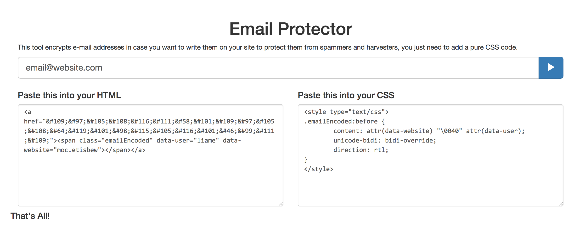

# Email Protector
This tool encrypts e-mail addresses in case you want to write them on public web pages to protect them from spammers and harvesters, you just need to add a pure CSS code.

You just need to put the email address in the box, press Enter (or click the submit button), and the page will generate the required encryption.

### Example:

Working demo: http://t.hmz.ie/email-protector